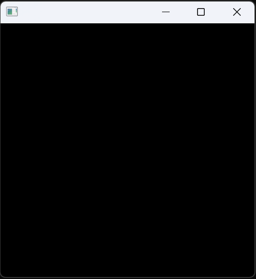
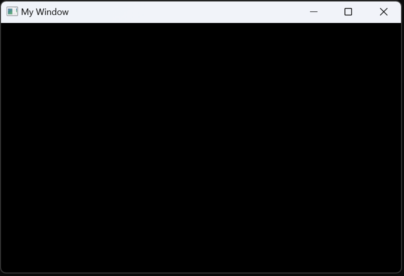

# Create a window

In order to create an empty window, include `lince.h` and call `LinceRun`:
```c
#include <lince.h>

int main() {

	LinceRun();

	return 0;
}
```

Compile your project again and you should see a bank window pop up.



You can customise the initial size of your window before you create it by retrieving a handle to the global application state:
```c
LinceApp* app = LinceGetApp();
```
Then, modify the `screen_width` and `screen_height` attributes:
```c
app->screen_width = 800; // Window width in pixels
app->screen_height = 500; // Window height in pixels
```
Finally, set the window title with `LinceAppSetTitle`. You must also provide its length.
This will appear on the top bar of your window.
```c
LinceAppSetTitle("My Window", sizeof("My Window")-1);
```
Note that the title must not be longer than 256 characters.

You should end up with the following code:
```c
#include <lince.h>

int main() {

	LinceApp* app = LinceGetApp();
	app->screen_width = 800;
	app->screen_height = 500;
	LinceAppSetTitle("My Window", sizeof("My Window")-1);

	LinceRun();

	return 0;
}
```


