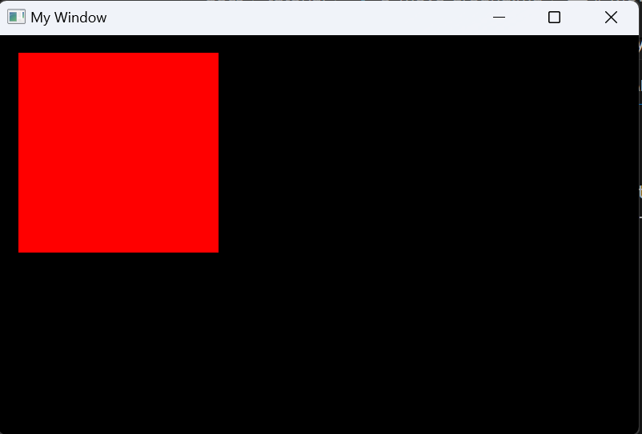

# Move around

In this section, we will learn how to move the camera around.
Let's pick up where we left off from [the previous tutorial](2_draw_square.md),
where we drew a red square:
```c
#include <lince.h>

LinceCamera camera;
LinceSprite square = {
    .x = 0, .y = 0,       // position at the centre of the screen
    .w = 1, .h = 1,       // size in "world coordinates"
    .color = {1, 0, 0, 1} // rgba, red and fully opaque
};

void OnInit(){
    LinceInitCamera(&camera, 800.0/500.0);
}

void OnUpdate(float dt){
    LinceBeginScene(&camera);
    LinceDrawSprite(&square, NULL);
    LinceEndScene();
}

int main() {

	LinceApp* app = LinceGetApp();
	app->screen_width = 800;
	app->screen_height = 500;
	LinceAppSetTitle("My Window");

    app->on_init = OnInit;
    app->on_update = OnUpdate;

	LinceRun();

	return 0;
}
```

We will now capture the keyboard input and use it to move our camera around.
To check if a key is bein pressed, use the function `LinceIsKeyPressed`. e.g. `LinceIsKeyPressed(LinceKey_a)`.
The codes for each key and mouse button are located in [`input/keycodes.h`](../../lince/src/lince/input/keycodes.h) and [`input/mousecodes.h`](../../lince/src/lince/input/mousecodes.h).

To move our camera around, we will use the WASD keys.
We'll check if any of these keys are being pressed in our `on_update` function,
and then move our camera's position at some speed.
The `x` and `y` positions of the camera are stored in the `pos[0]` and `pos[1]` attributes, respectively.
Finally, we will recalculate the camera's view with `LinceUpdateCamera`:
```c
void OnUpdate(float dt){

    const float speed = 0.005f; // units per millisec

    if(LinceIsKeyPressed(LinceKey_w)) camera.pos[1] += speed * dt; // move up
    if(LinceIsKeyPressed(LinceKey_s)) camera.pos[1] -= speed * dt; // move down
    if(LinceIsKeyPressed(LinceKey_d)) camera.pos[0] += speed * dt; // move right
    if(LinceIsKeyPressed(LinceKey_a)) camera.pos[0] -= speed * dt; // move left

    LinceUpdateCamera(&camera);

    LinceBeginScene(&camera);
    LinceDrawSprite(&square, NULL);
    LinceEndScene();
}
```
Compile the program and run it. If you press the keys WASD, you'll see you can now move around!


The final code will look like this:
```c
#include <lince.h>

LinceCamera camera;
LinceSprite square = {
    .x = 0, .y = 0,       // position at the centre of the screen
    .w = 1, .h = 1,       // size in "world coordinates"
    .color = {1, 0, 0, 1} // rgba, red and fully opaque
};

void OnInit(){
    LinceInitCamera(&camera, 800.0/500.0);
}

void OnUpdate(float dt){

    const float speed = 0.005f; // units per millisec

    if(LinceIsKeyPressed(LinceKey_w)) camera.pos[1] += speed * dt; // move up
    if(LinceIsKeyPressed(LinceKey_s)) camera.pos[1] -= speed * dt; // move down
    if(LinceIsKeyPressed(LinceKey_d)) camera.pos[0] += speed * dt; // move right
    if(LinceIsKeyPressed(LinceKey_a)) camera.pos[0] -= speed * dt; // move left

    LinceUpdateCamera(&camera);

    LinceBeginScene(&camera);
    LinceDrawSprite(&square, NULL);
    LinceEndScene();
}

int main() {

	LinceApp* app = LinceGetApp();
	app->screen_width = 800;
	app->screen_height = 500;
	LinceAppSetTitle("My Window");

    app->on_init = OnInit;
    app->on_update = OnUpdate;

	LinceRun();

	return 0;
}
```

