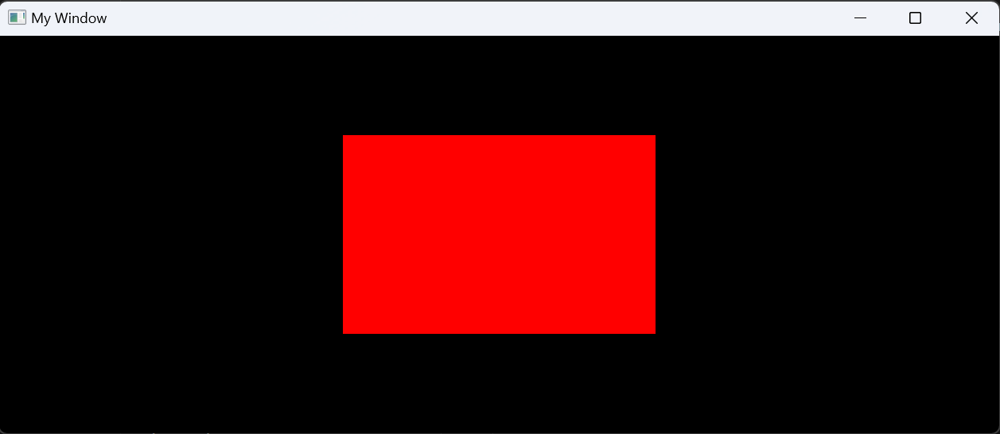

# Events

If you run your program again and change the dimensions of the window, you'll see that the square is stretched!


The reason is we are not telling the camera that the window has changed in size - it still thinks it's 800x500 and will render the square incorrectly.
First off, when we created the camera, we set the aspect ratio manually,
but we know this can change because the window can be resized.
To fix this, use the function `LinceAppGetAspectRatio()`, which will tell you the
aspect ratio of the window at any given point.
Since 
```c
void OnInit(){
    LinceInitCamera(&camera, LinceAppGetAspectRatio());
}
```

We then need to update the camera view with the function `LinceUpdateCameraProjection`, which takes the camera and the window's aspect ratio.
You can do this inside the `on_update` function, but it is expensive to do that every frame, as the window is not usually resized.
It's better to call this function *only* when the window is resized.

To do this, we will make use of another feature of the engine: events.
With events, we can tell the engine to run bits of code only when something specific happens, such as the window being resized.

We will do this with the `on_event` callback, which is another of the main ways of communicating with the engine, together with `on_init` and `on_update`.
This callback is only called when an event is propagated.
Let's create our event callback:
```c
void OnEvent(LinceEvent* event){

}
```

Then tell the engine where to find it with the variable `app->on_event`:
```c
/* main() */
    app->on_init = OnInit;
    app->on_update = OnUpdate;
    app->on_event = OnEvent;
```

Since, we are only interested on the window being resized,
we will check for the event of type `LinceEventType_WindowResize`,
and, if so, recalculate the projection of the camera:
```c
void OnEvent(LinceEvent* event){
    if(event->type == LinceEventType_WindowResize){
        LinceUpdateCameraProjection(&camera, LinceAppGetAspectRatio());
    }
}
```
Compile your application once again and check that changing the dimensions of the window
doesn't stretch the square!


The final code should look like this:
```c
// TO DO
```

