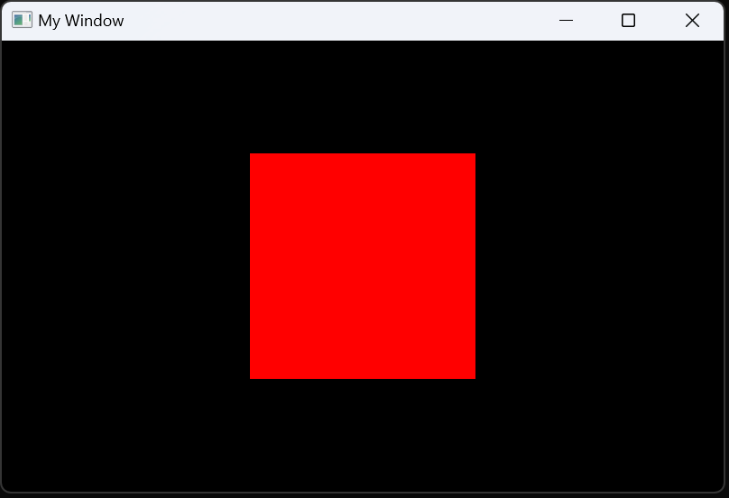

# Render a square

Let's continue with our program from the [previous tutorial](create_window.md),
where we created an empty window with customs dimensions and title:
```c
#include <lince.h>

int main() {

	LinceApp* app = LinceGetApp();
	app->screen_width = 800;
	app->screen_height = 500;
	LinceAppSetTitle("My Window");

	LinceRun();

	return 0;
}
```

To start working on your game and drawing stuff to the screen,
you need to communicate with the window you created.

You can do this by giving the engine some functions it will call for you.
These functions will contain your own code and they will tell the
window what to draw.

The most important one is the "update" function, which will be called once per frame.
This function should take one argument, the number of seconds since the last frame (e.g. `dt`), and should return nothing:
```c
void OnUpdate(float dt){
    // This will run every frame
}
```
Another important function is the "init" function, which is called only once when you program starts up.
This function takes no arguments and returns no value:
```c
void OnInit(){
    // This will run once at the beginning
}
```
Now, provide these functions to the application with the `on_update` and `on_init` attributes:
```c
app->on_init = OnInit;
app->on_update = OnUpdate;
```

Your program should look like this:
```c
#include <lince.h>

void OnInit(){

}

void OnUpdate(float dt){

}

int main() {

	LinceApp* app = LinceGetApp();
	app->screen_width = 800;
	app->screen_height = 500;
	LinceAppSetTitle("My Window");

    app->on_init = OnInit;
    app->on_update = OnUpdate;

	LinceRun();

	return 0;
}
```

Then, we need to set up a camera.
The camera translates the positions of objects in the game to the screen using a transformation matrix.
Declare it at the top of the file, under the include.
```c
LinceCamera camera;
```
And initialise it from the "OnInit" function.
This requires the aspect ratio of your window, which we know it is 800/500, or 1.6.
```c
void OnInit(){
    LinceInitCamera(&camera, 800.0/500.0);
}
```

Next, create the square sprite we are going to render.
Declare it at the top of the file, next to the camera,
and provide its parameters, like the position (`x` and `y`), size (`w` and `h`),
and RGBA colour (`color`).
You must specify a transparency of 1 or the sprite won't be visible!
```c
LinceSprite square = {
    .x = 0, .y = 0,       // position at the centre of the screen
    .w = 1, .h = 1,       // size in "world coordinates"
    .color = {1, 0, 0, 1} // rgba, red and fully opaque
};
```

Finally, on our update function, draw the square with the `LinceDrawSprite` function.
This function will always have to be wrapped between the `LinceBeginScene` and `LinceEndScene` functions,
which prepare the engine for rendering.

```c
void OnUpdate(float dt){
    LinceBeginScene(&camera);
    LinceDrawSprite(&square, NULL);
    LinceEndScene();
}
```

Your code should look like this:
```c
#include <lince.h>

LinceCamera camera;
LinceSprite square = {
    .x = 0, .y = 0,       // position at the centre of the screen
    .w = 1, .h = 1,       // size in "world coordinates"
    .color = {1, 0, 0, 1} // rgba, red and fully opaque
};

void OnInit(){
    LinceInitCamera(&camera, 800.0/500.0);
}

void OnUpdate(float dt){
    LinceBeginScene(&camera);
    LinceDrawSprite(&square, NULL);
    LinceEndScene();
}

int main() {

	LinceApp* app = LinceGetApp();
	app->screen_width = 800;
	app->screen_height = 500;
	LinceAppSetTitle("My Window");

    app->on_init = OnInit;
    app->on_update = OnUpdate;

	LinceRun();

	return 0;
}
```

Compile your project once again and you should see the red square!



